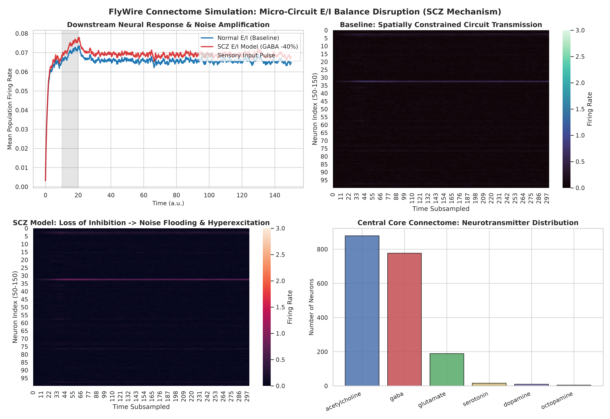

# FlyWire Connectome Schizophrenia E/I Simulation

초파리 전뇌 커넥톰(FlyWire / BANC) 공개 데이터를 활용해 조현병(Schizophrenia)의 핵심 가설인 **E/I Balance(흥분성/억제성 신경전달 불균형)**를 회로 수준에서 시뮬레이션하고 탐구해보는 개인 토이/연구 프로젝트입니다.

---

## 📌 무엇을 실험했는가?

1. **데이터**:
   - 2024년 공개된 초파리 전뇌 커넥톰 (BANC v888: 188k 뉴런, 1,170만 시냅스).
   - 각 뉴런의 실제 신경전달물질(Acetylcholine, Glutamate, GABA, Dopamine 등) 라벨 활용.

2. **실험 모델 (E/I 섭동)**:
   - **Baseline (정상군)**: 정상적인 흥분(ACh/Glu)과 억제(GABA)의 균형 상태.
   - **SCZ Model (조현병 모델)**: 조현병의 유력한 병리기전인 GABA성 억제성 뉴런 기능 저하(GABA 가중치 40% 감소) 적용.

3. **관찰 지점**:
   - 동일한 감각 자극 펄스를 주었을 때, 다운스트림 회로에서 신호가 정상적으로 꺼지는지(정상), 아니면 억제 실패로 인해 배경 잡음이 폭발적으로 증폭되는지(조현병 모델) 비교.

---

## 📊 결과 요약



- **정상 (Baseline)**: 자극이 끝나면 억제성 루프가 작동하여 신호가 깔끔하게 가라앉고 높은 신호 대 잡음비(SNR) 유지.
- **조현병 모델 (GABA -40%)**: 억제력 상실로 인해 자극 종료 후에도 신경 흥분이 가라앉지 않고 회로 전체가 배경 노이즈로 도배되는 현상(Noise Flooding / Runaway Excitation) 확인.

---

## 🚀 재현 방법

```bash
# 가상환경 세팅
python3 -m venv .venv
source .venv/bin/activate
pip install -r requirements.txt

# 데이터 다운로드 (GCS 공개 버킷)
curl -L https://storage.googleapis.com/lee-lab_brain-and-nerve-cord-fly-connectome/compiled_data/banc_888/banc_888_meta.feather -o data/banc_888_meta.feather
curl -L https://storage.googleapis.com/lee-lab_brain-and-nerve-cord-fly-connectome/compiled_data/banc_888/banc_888_edgelist_simple_v2.feather -o data/banc_888_edgelist_simple_v2.feather

# 시뮬레이션 실행
python pipelines/01_ei_perturbation_simulation.py
```

누구나 훈수, 피드백, 모델 개선 PR 환영합니다!
